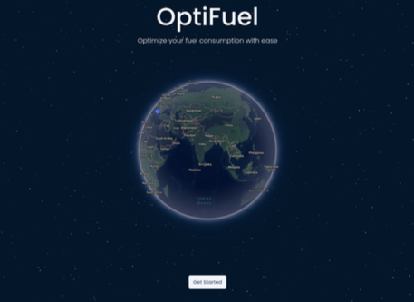
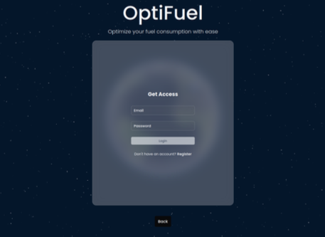
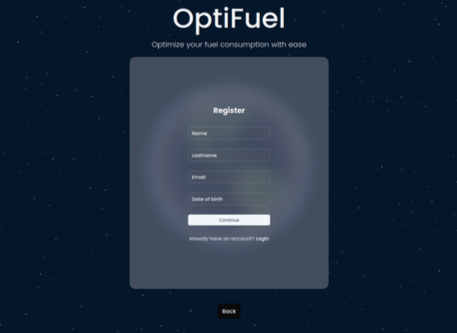
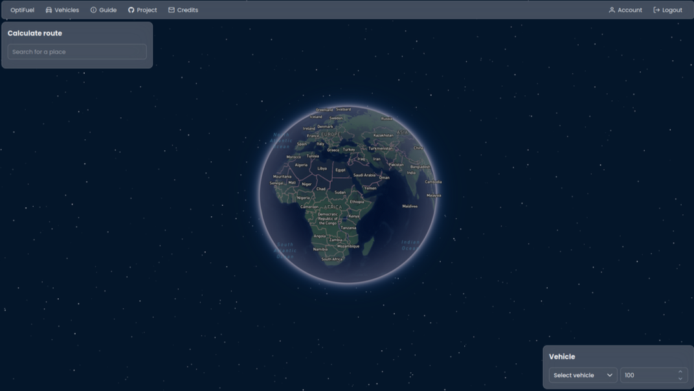
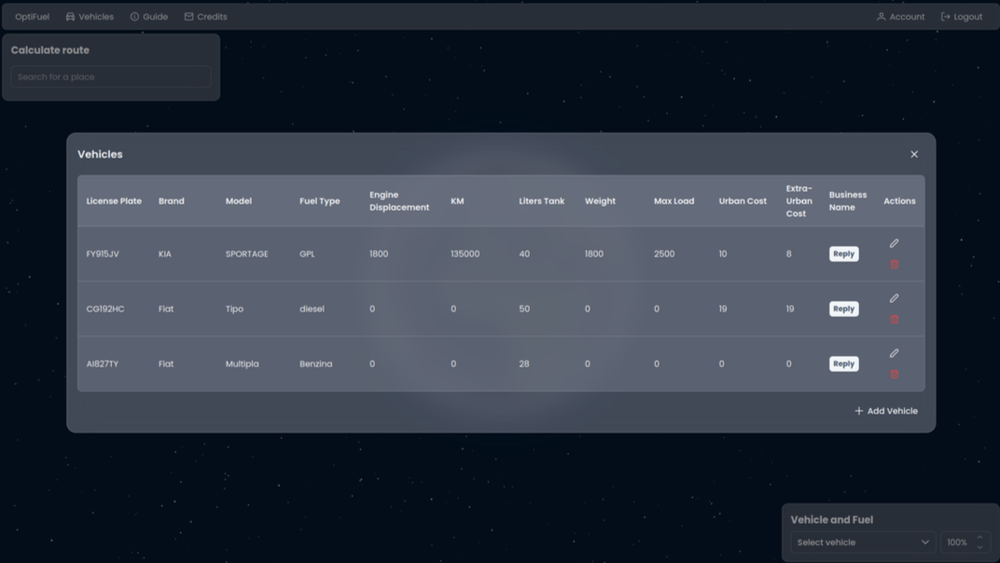
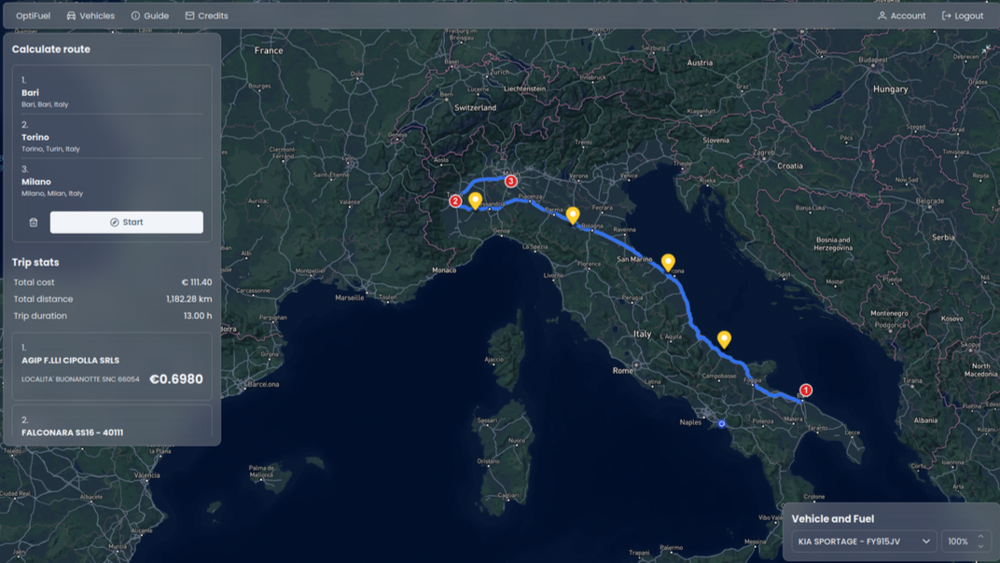

# OptiFuel Frontend Documentation

This documentation describes the structure and components of the OptiFuel frontend application, developed using Angular.

## Overview

The frontend is a Single Page Application (SPA) built with Angular. It provides the user interface for interacting with the OptiFuel route optimization system. It communicates with the .NET backend via REST APIs.

## Main Sections

The frontend is organized into several key sections to provide a fluid user experience:

### 1. Landing Page

* **Purpose:** Serves as the initial entry point to the application.
* **Functionality:** Presents the application and offers users the choice to either register as a new user or log in with existing credentials. Designed for quick access to the system.

    

### 2. Login / Registration

* **Purpose:** Handles user authentication and account creation.
* **Functionality:**
    * Provides a login form for existing users.
    * Provides a registration form for new users.
    * Ensures a secure and user-friendly credential management flow.

    
    

### 3. Dashboard

* **Purpose:** The main user interface after login, where core functionalities are accessed.
* **Functionality:**
    * Displays points of interest along the user's calculated itinerary.
    * Shows the system-calculated optimal route, including suggested fuel stops based on convenience/cost.
    * Features a central map display (implied by screenshots).
    * Includes a **Toolbar** providing access to various features:
        * **Modify Account Data:** Allows users to edit their profile information.
        * **Select Vehicles:** Enables users (especially business users) to choose the vehicle(s) for route calculation.
        * **"How to Use":** Provides a tutorial explaining the application's main features.
        * **Info:** Displays miscellaneous information and potentially credits or links.
        * **(Implied):** Logout functionality.
    * Displays trip statistics once a route is calculated.

    
    
    

